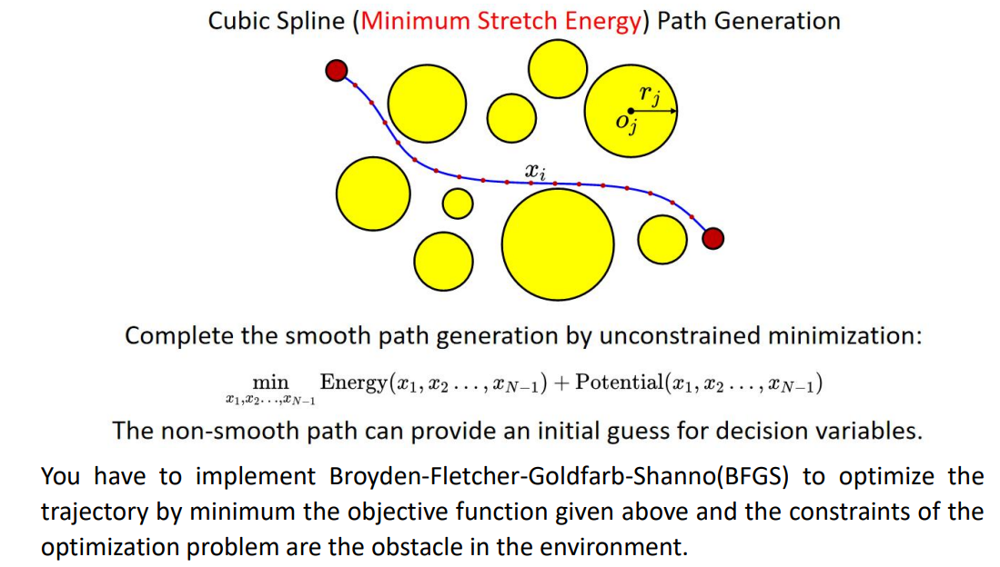

Smooth-Local-Planner
------------
简单的考虑障碍物与路径长度的基于无约束优化局部路径规划算法实现

<div align="center">
    <div align="center">
        
    </div>
    <font color=#a0a0a0 size=2>The key points of the Smooth-Local-Planner.</font>
</div>

运行
-----------
```
ros2 launch smooth_local_planner smooth_local_planner.launch.py
```

订阅话题（话题名可在yaml文件更改）
targetTopic： 目标点话题，需要订阅两次（表示起点和终点）
obstacleTopic： 障碍物点话题，PoseWithCovarianceStamped类型，x和y对应障碍物坐标

可以把这两话题名设置为"/goal_pose"和"/initialpose"，可以使用rviz进行发布方便调试

参考资料：
-----------
深蓝学院机器人中的数值优化课程

数值优化方法博客专栏：https://blog.csdn.net/qq_44339029/category_12280511.html

深蓝学院作业路径优化开源实现：https://github.com/JinZQ56/NumericalOptimization.git

深蓝学院官方作业开源：https://github.com/Jinqi-J/Numerical-Optimization-in-Robotics-Homework.git

FAST-Lab 开源GCOPTER：https://github.com/ZJU-FAST-Lab/GCOPTER